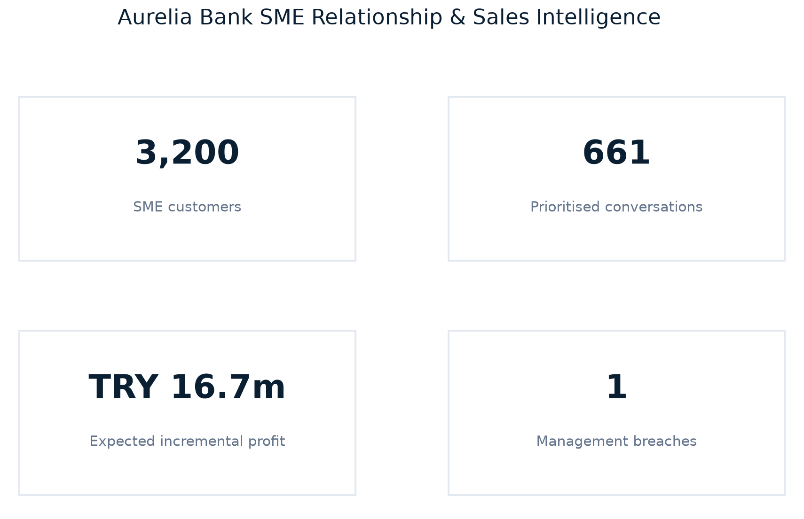
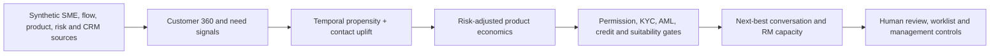

# Aurelia Bank SME Relationship & Sales Intelligence Control Tower

[](https://github.com/muratmiracg-dev/aurelia-bank-sme-relationship-sales-intelligence-control-tower/actions/workflows/ci.yml)
[](https://github.com/muratmiracg-dev/aurelia-bank-sme-relationship-sales-intelligence-control-tower/actions/workflows/codeql.yml)
[](https://www.python.org/)
[](LICENSE)
[](docs/conduct_and_human_oversight.md)

An end-to-end, portfolio-grade **SME relationship-banking and sales decision-support
platform** for the fictional Aurelia Bank. It combines Customer 360, relationship depth,
multi-product need signals, temporal propensity modeling, treatment/control uplift,
risk-adjusted profitability, next-best-conversation prioritisation, relationship-manager
capacity and conduct governance.

> [!CAUTION]
> Every customer, employee, interaction, holding, flow and campaign record is controlled
> synthetic. The solution cannot sell a product, approve credit, restrict a customer or make a
> binding suitability decision. Outputs are review leads for authorised staff, not production
> recommendations, regulatory compliance evidence or financial forecasts.



## Verified executive snapshot

The deterministic pipeline uses seed `20260821` and a portfolio cutoff of **20 August 2026**.

| Evidence | Verified result |
|---|---:|
| Controlled synthetic SME customers | **3,200** |
| Relationship managers | **48** |
| Existing product holdings | **7,044** |
| Historical treatment/control campaigns | **16,000** |
| Candidate customer-product opportunities | **18,556** |
| Eligible / policy-qualified candidates | **12,250 / 1,254** |
| Capacity-allocated next-best conversations | **661** |
| Illustrative expected incremental profit | **TRY 16.74m** |
| Weighted activation probability | **42.23%** |
| Champion ROC AUC / PR AUC | **0.715 / 0.495** |
| Champion Brier score / top-decile lift | **0.182 / 2.07x** |
| Data-quality controls | **14 / 14 passed** |
| Management controls | **9 passed / 1 breach** |

The single management breach is intentionally visible: **38.09% of customers have an overdue
KYC review versus a 30% internal ceiling**. The recommendation is to remediate the backlog
without bypassing sales suppressions or consuming uncontrolled RM capacity.

The TRY 16.74m value is a synthetic, assumption-driven estimate:
`positive contact uplift × first-year risk-adjusted profit - contact cost`. It is not a budget,
accounting forecast or promised commercial outcome.

## Business problem

Commercial banks often hold customer, product, transaction, credit-risk, campaign and CRM data
in separate systems. A high response probability can still be a poor conversation when the
customer has no demonstrated need, expected economics are negative, consent is absent, KYC is
stale, credit risk is outside policy or the relationship manager has no capacity.

This project answers five connected questions:

1. Where is the bank's SME relationship shallow relative to observable business activity?
2. Which product conversation is most relevant for each customer now?
3. Does contact create incremental response rather than merely identify likely buyers?
4. Is the opportunity attractive after funding cost, expected loss and capital charge?
5. Can the conversation be allocated without violating conduct, risk or capacity controls?

## What is implemented

- **SME Customer 360:** firm profile, RM ownership, flows, product holdings, relationship depth,
  wallet-share proxy, contact history, PD, arrears, KYC and AML context.
- **Eight-product need layer:** working-capital loan, POS acquiring, business card, payroll,
  cash management, trade finance, term deposit and FX risk management.
- **Temporal propensity validation:** interpretable logistic champion and histogram-gradient
  challenger with ROC AUC, PR AUC, Brier, log loss and top-decile lift.
- **Treatment/control uplift:** T-learner contact and no-contact models, ranked deciles and
  observed incremental-rate diagnostics.
- **Explainable decisioning:** need, relationship, risk and engagement reason codes; model
  explanations are associative rather than causal.
- **Risk-adjusted economics:** gross income, FTP-style funding cost, `PD × LGD × EAD`, allocated
  capital, capital charge, service cost, first-year profit and illustrative RAROC.
- **Conduct gates:** contact permission, beneficial ownership, KYC freshness, AML priority,
  credit policy, arrears, financial-statement freshness and documented FX need.
- **Next-best-conversation:** one customer-level conversation, product-specific prompt, finite
  RM capacity, SLA, worklist and final human owner.
- **Operational diagnostics:** size/region selection rates, KYC backlog, RM utilisation,
  suppressions, automated-sale control and management actions.
- **Delivery product:** Python package, read-only FastAPI, Typer CLI, PostgreSQL, SQLite,
  Power BI assets, Excel workbench, executive deck, PDF report, tests and CI/security workflows.

## Decision architecture



The order is deliberate: commercial relevance does not override a risk or conduct gate, and a
model score never becomes a customer-facing action without authorised review.

## Product conversation catalog

| Product | Primary need evidence | Mandatory review boundary |
|---|---|---|
| Working Capital Loan | Cash-flow gap, loan use and business scale | Credit underwriting remains separate |
| POS & Merchant Acquiring | Merchant inflows, POS share and digital engagement | Commercial terms require RM confirmation |
| Business Credit Card | Digital use, purchasing scale and workforce | Credit and limit approval remain separate |
| Payroll Services | Employee count and payroll outflows | Customer need and operational feasibility |
| Cash Management | Payments, collections and digital activity | Process design confirmed with customer |
| Trade Finance | Import/export and trade flows | Credit, sanctions and document review |
| Term Deposit | Surplus liquidity and deposit balance | Horizon and liquidity needs confirmed |
| FX Risk Management | Documented FX exposure | Suitability, treasury and human approval |

See the full [product catalog](docs/product_catalog.md) and
[profitability framework](docs/profitability_framework.md).

## Repository map

```text
.
├── src/aurelia_sme_sales/    # Data, features, modeling, economics, controls, API and CLI
├── config/                   # Governed product, score, policy and economics assumptions
├── data/                     # Controlled synthetic demo data and official source register
├── artifacts/                # Reproducible results, SQLite database and analytical figures
├── tests/                    # 39 unit and integration tests; 90% enforced coverage gate
├── sql/                      # PostgreSQL schema, views and management queries
├── powerbi/                  # DAX library, theme and seven-page dashboard specification
├── excel/                    # Formula-driven RM and profitability workbench
├── presentation/             # Editable English executive deck
├── report/                   # Ten-page executive PDF report
├── docs/                     # Method, governance, validation, playbooks and portfolio material
├── scripts/                  # Demo, manifest, cleanup and artifact verification
├── Dockerfile
├── docker-compose.yml
├── Makefile
└── pyproject.toml
```

## Quick start

```bash
python -m venv .venv
source .venv/bin/activate
python -m pip install -e ".[dev]"
make demo
make lint
make coverage
```

The high-volume generated files below are intentionally excluded from Git history and are
recreated with `make demo`:

- `data/demo/monthly_flows.csv`
- `data/demo/campaign_history.csv`
- `artifacts/results/candidate_features.csv`
- `artifacts/results/product_opportunities.csv`

The committed workbook, management outputs and compact SQLite database retain sufficient
evidence for portfolio review without bloating the repository.

## Read-only API

```bash
uvicorn aurelia_sme_sales.api:app --reload
```

| Endpoint | Purpose |
|---|---|
| `GET /health` | Service and synthetic-demo mode |
| `GET /api/v1/portfolio/summary` | Verified executive metrics and digest |
| `GET /api/v1/customers/{id}/next-conversation` | Customer-level governed conversation |
| `GET /api/v1/rms/{id}/worklist` | Capacity-allocated RM worklist |
| `GET /api/v1/products/{code}/opportunities` | Policy-qualified product view |
| `GET /api/v1/controls` | Management controls and remediation owners |

No endpoint executes contact, records a final decision or returns real bank data.

## Professional deliverables

| Deliverable | Location |
|---|---|
| Formula-driven SME relationship and sales workbench | [`excel/Aurelia_Bank_SME_Relationship_Sales_Workbench.xlsx`](excel/Aurelia_Bank_SME_Relationship_Sales_Workbench.xlsx) |
| 12-slide editable executive deck | [`presentation/Aurelia_Bank_SME_Relationship_Sales_Executive_Deck_EN.pptx`](presentation/Aurelia_Bank_SME_Relationship_Sales_Executive_Deck_EN.pptx) |
| 10-page executive report | [`report/Aurelia_Bank_SME_Relationship_Sales_Executive_Report.pdf`](report/Aurelia_Bank_SME_Relationship_Sales_Executive_Report.pdf) |
| Compact governed SQLite database | [`artifacts/aurelia_sme_sales_demo.sqlite`](artifacts/aurelia_sme_sales_demo.sqlite) |
| Model card | [`docs/model_card.md`](docs/model_card.md) |
| Validation report | [`docs/validation_report.md`](docs/validation_report.md) |
| RM playbook | [`docs/rm_playbook.md`](docs/rm_playbook.md) |
| Interview guide | [`docs/portfolio/interview_guide.md`](docs/portfolio/interview_guide.md) |

## Governance and interpretation

- Propensity estimates association with synthetic activation; they do not establish intent.
- Uplift is estimated from randomized synthetic treatment/control history; production use would
  require experiment governance, stability testing and independent validation.
- RAROC is a transparent portfolio illustration, not the bank's accounting or regulatory model.
- Size-band and region selection rates are operational diagnostics, not proof of legal fairness.
- Contact permission is necessary but does not replace product eligibility, suitability or RM
  judgment.
- Credit, AML, KYC and suitability processes remain authoritative and outside this sales engine.

The governance design is informed by, but does not claim conformity with, the
[BDDK Monthly Banking Sector Data](https://www.bddk.org.tr/BultenAylik/),
[TCMB EVDS user documentation](https://evds2.tcmb.gov.tr/index.php?/evds/userDocs=),
[KVKK data-subject rights](https://www.kvkk.gov.tr/Icerik/6938/Kurumumuza-Yapilan-Sikayetlerin-Usul-Sartlarina-Iliskin-Kamuoyu-Duyurusu),
[EBA product oversight and governance guidance](https://www.eba.europa.eu/activities/single-rulebook/regulatory-activities/consumer-protection/guidelines-product-oversight-and-governance-arrangements-retail-banking-products),
and [Basel credit-risk principles](https://www.bis.org/bcbs/publ/d595.pdf).

## Reproducibility

```bash
make demo
make lint
make coverage
make manifest
make verify
```

The current canonical result digest is:

```text
61fb583b4488eaa3f07625303fa824037a8929bd8b69042d21536089bf4000c8
```

## License

Code is released under the [MIT License](LICENSE). Synthetic datasets, financial assumptions
and documents are provided for demonstration and education only.
